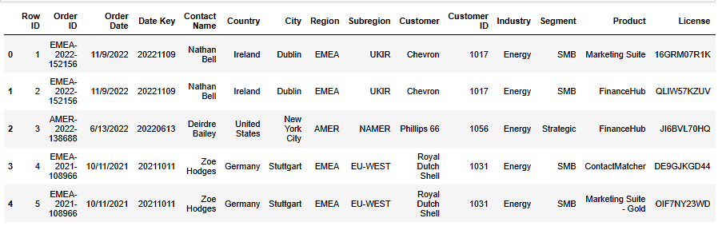
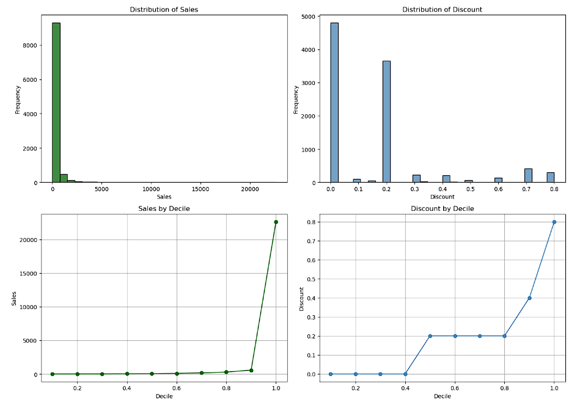
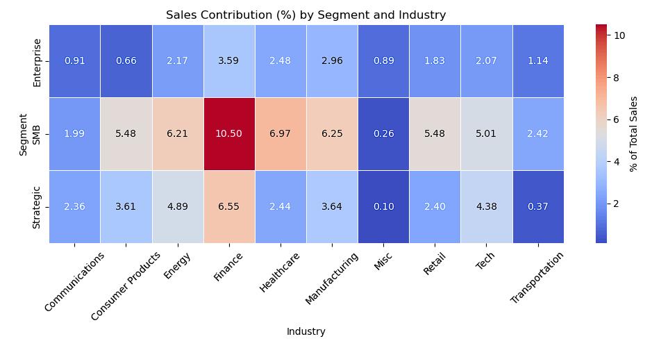
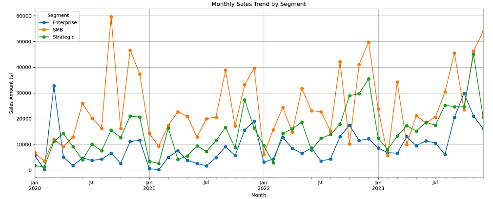
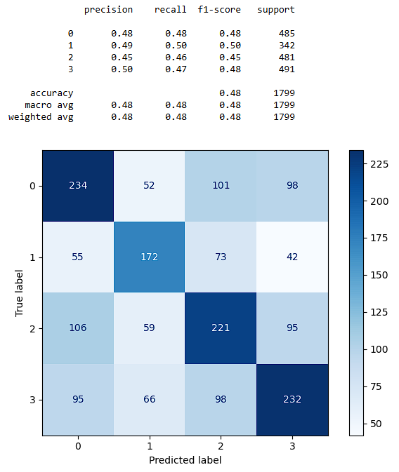

# SaaS Product Recommendation for Targeted Marketing  
 

**Pablo Cisternas G. **  

[🔗Click here to view SaaS Product Recommendation for Targeted Marketing](https://github.com/pacg92/Capstone-Project-II-Final-Report/blob/master/Capstone%20Project%20-%20SaaS%20Product%20Recommendation%20for%20Targeted%20Marketing.ipynb)

## Executive summary  
This project aims to support a SaaS sales department in optimizing its marketing campaigns by recommending the most likely product a B2B customer will purchase. Using a dataset of ~10,000 historical transactions, we built predictive models based on client segment, industry, seasonality, and transaction value. Our best-performing model, a Decision Tree, achieved approximately 48–51% accuracy and provides interpretable decision rules. These insights can be embedded in the marketing workflow to boost conversion rates, currently around ~10%, by enabling more targeted and timely outreach.

---

## Rationale  
- Marketing teams currently rely on manual heuristics and broad segmentation, which results in inefficient targeting and low campaign conversion (~10%). 
- A data-driven product recommender can help personalize outreach, reduce wasted efforts, and improve revenue per campaign.
- This approach supports more efficient allocation of marketing resources while enhancing the client experience.

---

## Research Question   
 
Which SaaS product category is a given customer most likely to purchase next, considering their segment, industry, and seasonal purchasing behavior?

---

## Data Sources  
Due to data protection laws and company security policies, access to real transactional data was restricted. Instead, the [Amazon AWS SaaS Sales Dataset](https://www.kaggle.com/datasets/nnthanh101/aws-saas-sales/data) was selected as a suitable alternative due to its strong similarity to the originally intended data and its relevance for modeling purposes.

Historical Amazon AWS SaaS Sales Dataset (~10,000 transactions), containing fields such as:  
  - `Order Date` (YYYY-MM-DD)  
  - `Industry`, `Segment`  
  - `Product Purchased`  
  - `Sales`, `Discount`, `Profit`  

#### Numerical Variable Distribution
The distribution of `Sales` is highly skewed due to outliers, with 90% of values below 3000, while a few exceed 20000. The `Discount` field is concentrated between 0% and 20% in 86% of transactions, suggesting moderate and selective discounting strategies.

#### Segment-Industry Interaction
The heatmap of sales contribution (%) reveals that the combination of `SMB` and `Finance` represents over 10% of total sales, with other important pairs including `SMB + Healthcare` and `Strategic + Finance`.

#### Time Series and Seasonality
The time series analysis confirms both a yearly seasonality and an upward trend in overall sales. Decomposition of the monthly sales indicates a predictable cyclic pattern. This validates the inclusion of temporal features (month, quarter) in the predictive model.

---

## Methodology    
1. **Data Understanding & Preparation**: cleaning, outlier removal, feature engineering.  
2. **Exploratory Analysis**: distribution plots, seasonality decomposition, segment-industry heatmaps.  
3. **Modeling**: train/test split (80/20), label encoding, pipelines with StandardScaler and classifiers.  
4. **Model Selection & Tuning**: Decision Tree, Random Forest, XGBoost, KNN; grid search with 5-fold CV.  
5. **Model Improvement**: robust CV, learning curves, hyperparameter tuning, class-weighted adjustments.  
6. **Evaluation**: hold-out test metrics (accuracy, F1, recall by class), confusion matrices, rule extraction.

---

## Results    
- The **Decision Tree** model achieved ~48% accuracy and balanced recall across four product categories.  
- Top predictors: **Regular Sale amount**, **Industry Category**, **Segment**, **Quarter**.  
- Extracted decision rules (e.g., low sale amounts in Q2 for Core Economic → Product A) provide clear marketing triggers.

| Model          | Accuracy | F1-Score | Strengths                               | Weaknesses                       |
|----------------|----------|----------|------------------------------------------|----------------------------------|
| Decision Tree  | ~0.48    | ~0.48    | Transparent, interpretable, fast         | Slightly overfits at times       |
| Random Forest  | ~0.26    | ~0.26    | Handles variance, robust to noise        | Less interpretable               |
| XGBoost        | ~0.27    | ~0.27    | High performance, handles complexity     | Requires more computation        |
| KNN            | ~0.29    | ~0.28    | Easy to implement, no training phase     | Sensitive to feature scaling     |

Despite lower absolute performance, the **Decision Tree** model was selected due to its superior interpretability and competitive accuracy. This allows the business team to better understand the logic behind predictions, making it easier to align product offerings with customer needs and commercial strategies.

---

## Next steps   
- Enrich features with RFM (recency, frequency, monetary) and behavioral data (web/app usage).  
- Explore ensemble models with optimized parameters (subsampling, learning rate) for further gains.  
- Implement A/B testing of model-driven campaigns to measure lift versus current practices.  
- Automate retraining pipeline and monitor model drift over time.

---

#### Project Notebook  

[🔗Click here to view SaaS Product Recommendation for Targeted Marketing](https://github.com/pacg92/Capstone-Project-II-Final-Report/blob/master/Capstone%20Project%20-%20SaaS%20Product%20Recommendation%20for%20Targeted%20Marketing.ipynb) 

##### Contact and Further Information  
For questions or collaboration, please contact [pcisternas@fen.uchile.cl](mailto:pcisternas@fen.uchile.cl) or visit the project repository on GitHub.  
